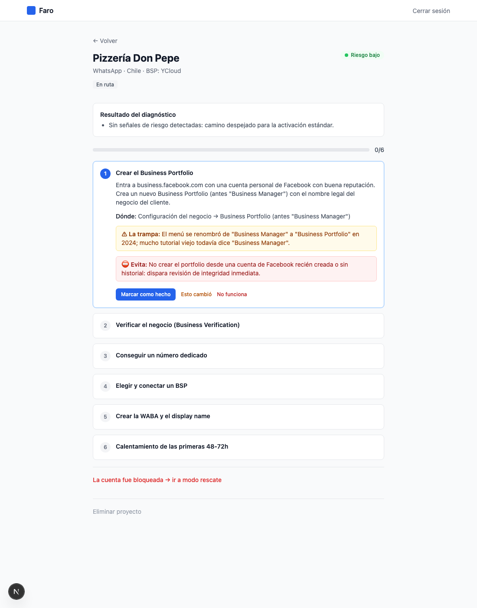

# Faro

> Hecho con **Raíz** 🌱 — template Agent-First para SaaS (Next.js 16 + Supabase).

Onboarding guiado para activar cuentas de WhatsApp / Instagram Business **sin bloqueos de Meta**, pensado para implementadores de agentes conversacionales.

No es otro constructor de bots: es un **wizard de activación + blindaje + modo rescate**. Convierte un proceso opaco e irreproducible en uno confiable. Diagnostica el riesgo de la cuenta, genera una ruta paso a paso (con la trampa de cada paso visible), y si Meta bloquea, ofrece un playbook de rescate en vez de abandonarte.



## Stack

- **Next.js 16** (App Router) + React 19 + TypeScript
- **Supabase** (Auth + Postgres + RLS)
- **Tailwind CSS** + **Zod**
- **Playwright** para E2E

## Qué incluye

- Auth email/password con perfiles y RLS.
- **Proyectos** por cliente (aislados por owner).
- **Backend editorial** (`/admin/conocimiento`): Pasos atómicos reutilizables, rutas ramificadas, playbooks de rescate, vista de curaduría ordenada por reportes y antigüedad.
- **Diagnóstico** → semáforo de riesgo (verde/amarillo/rojo) + asignación automática de ruta.
- **Wizard** paso a paso con checkpoint pre-producción y protocolo de calentamiento.
- **Modo rescate** con playbook por tipo de restricción.
- **Reportes** ("esto cambió") que alimentan la curaduría (red colectiva).

---

## Deploy

### 1. Crea tu proyecto Supabase

1. Crea un proyecto en [supabase.com](https://supabase.com).
2. Aplica el esquema. Con la [Supabase CLI](https://supabase.com/docs/guides/local-development):
   ```bash
   supabase link --project-ref <TU_REF>
   supabase db push        # aplica supabase/migrations/*
   ```
   O pega el contenido de `supabase/migrations/*.sql` (en orden) en el SQL Editor del dashboard.
3. (Opcional) Carga contenido de ejemplo: ejecuta `supabase/seed.sql` en el SQL Editor.
4. En **Authentication → URL Configuration**: Site URL `http://localhost:3000` (y tu dominio de Vercel) + Redirect URLs `http://localhost:3000/**`.
5. Para probar sin SMTP, desactiva **Confirm email** en Authentication → Providers → Email.

### 2. Variables de entorno

Copia `.env.example` a `.env.local` y rellena (Supabase → Project Settings → API):

| Variable | Qué es |
|---|---|
| `NEXT_PUBLIC_SUPABASE_URL` | URL del proyecto |
| `NEXT_PUBLIC_SUPABASE_ANON_KEY` | Anon/publishable key |
| `SUPABASE_SERVICE_ROLE_KEY` | **Secreta**, server-only. Solo el backend editorial la usa |
| `NEXT_PUBLIC_SITE_URL` | URL pública del sitio |
| `FARO_EDITOR_EMAILS` | Emails (coma-separado) que pueden editar el conocimiento en `/admin` |

> `SUPABASE_SERVICE_ROLE_KEY` nunca se expone al cliente. Solo emails en `FARO_EDITOR_EMAILS` acceden a `/admin/conocimiento` (allowlist fail-closed).

### 3. Local

```bash
npm install
npm run dev        # http://localhost:3000
```

### 4. Vercel

1. Importa el repo en [vercel.com/new](https://vercel.com/new).
2. Carga las mismas variables de entorno (incluida `SUPABASE_SERVICE_ROLE_KEY` como secreta).
3. Deploy. Actualiza la Site URL y las Redirect URLs de Supabase con el dominio de Vercel.

---

## Tests

```bash
npx playwright install chromium   # primera vez
npx playwright test               # E2E del flujo completo
```

## Estructura

```
src/
├── app/                 # rutas (App Router): (auth), (main), admin/
├── features/            # Feature-First: auth, proyectos, conocimiento, diagnostico, wizard
├── lib/supabase/        # clientes browser / server / admin (service role)
└── lib/auth/            # allowlist de editores
supabase/migrations/     # esquema (aplícalo en tu proyecto)
supabase/seed.sql        # contenido de ejemplo (ilustrativo)
e2e/                     # tests Playwright
```

## Hecho con Raíz

Este proyecto se construyó con **Raíz**, un template Agent-First (Next.js 16 + Supabase + RLS): de la entrevista de negocio al plan, y del plan al código fase por fase, con QA E2E y auditoría de seguridad.

## Licencia

MIT — ver [LICENSE](LICENSE).
